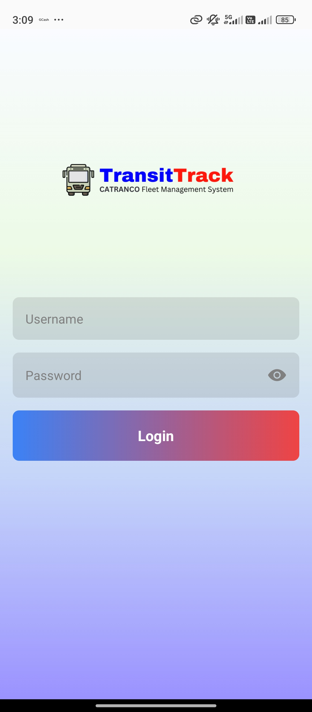
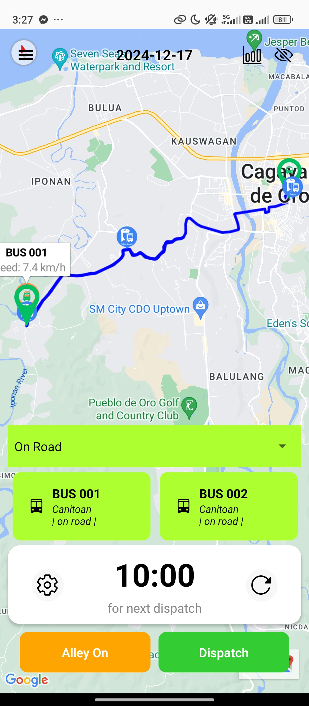

# **Welcome to TransitTrack Mobile Application** 👋

## **About the Application**

This app is designed for Dispatchers. Their account credentials, which include the username and password on the mobile application, follow the format: `Surname_DateHired`. For example, if the surname is "Paler" and the date hired is March 12, 2025, the credentials would be `Paler_031225`.

The web application handles the account creation. As the admin starts inputting their employee credentials, it will automatically create their accounts.

**This application is built using React Native.**

## **Application Preview**

|  |  |
|:----------------------------------------:|:----------------------------------------:|
| *Login screen of the TransitTrack Mobile Application.* | *Dashboard view for dispatchers.* |

## **Getting Started**

Follow these steps to set up and run the React Native mobile application:

### **Prerequisites**

- Ensure you have Node.js and npm installed on your machine.
- Install an IDE like Visual Studio Code.

### Setup Instructions

1. **Open Terminal or Command Prompt**

   - Navigate to the project directory:
     ```sh
     cd CATRANCO-FMS-Mobile
     ```

2. **Open the Project in Your IDE**

   - Use the following command to open the project in Visual Studio Code:
     ```sh
     code .
     ```

3. **Install Dependencies**

   - Run the following command to install all necessary dependencies:
     ```sh
     npm install
     ```

4. **Download Android Resources**

   - Download the required Android resources from [this link](https://drive.google.com/drive/folders/1xGtj5Cvj1N0QaSIy9-tqpopmvlecr-1_?usp=sharing).
   - Copy and paste the downloaded resources into the appropriate folder.

5. **Configure AndroidManifest.xml**

   - Update the `android/app/src/main/AndroidManifest.xml` file to include your Google Maps API key.

6. **Update API URL**

   - Change the `apiUrl` in `constants/apiURL` to your Wi-Fi IPv4 address. For example:
     ```
     http://192.168.1.100:8000
     ```
   - Replace `192.168.1.100` with your own IP address.

### Optional: Build the App

- To build the app for development, use the following command:
  ```sh
  eas build --profile development --platform android
  ```

### Start the Application

- Run the app using:
  ```sh
  npm start
  ```

## Additional Resources

- For further assistance, refer to the official React Native documentation or reach out to the project maintainers.
- **Don't forget to set up [Pusher](https://pusher.com/) and [Flespi](https://flespi.io/) API.**